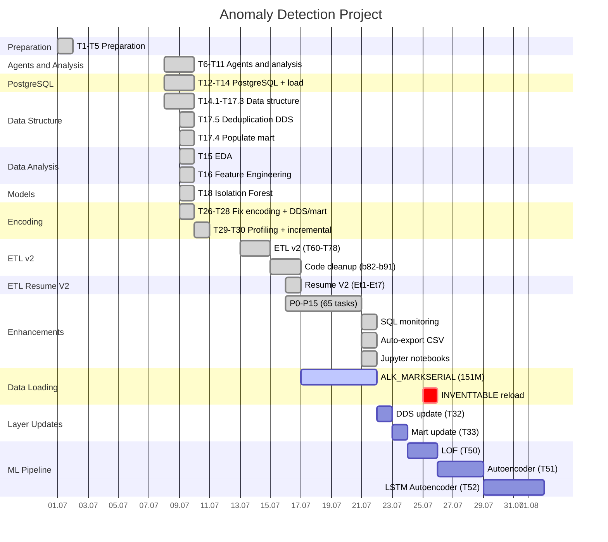

# ЕДИНЫЙ СТАТУС И ПЛАНИРОВАНИЕ ПРОЕКТА

**Обновлено:** 2026-07-07

---

## 1. Общая сводка проекта

| Метрика | Значение |
|---------|----------|
| Готовность | 96% |
| Python файлов | 306 |
| Python строк | 77,269 |
| SQL файлов | 171 |
| SQL строк | 14,657 |
| Тестовых файлов | 9 |
| Зависимостей | 13 |
| Ноутбуков | 5 |

---

## 2. Текущее состояние ETL

| Таблица | Источник (SS) | Цель (PG) | % | Статус |
|---------|---------------|-----------|---|--------|
| INVENTTABLE | 1,047,184 | 634,248 | 60.6% | ⚠️ Требует reload |
| ALK_MARKSERIAL | 151,817,640 | ~107M | ~70% | ⏳ Загружается (run 19) |
| LFL_SCSPACKTASK | 7,622,335 | 7,622,335 | 100% | ✅ Загружена |
| WMSORDERTRANS | 45,750,473 | ~37M | ~81% | ⏳ Частично |
| SALESTABLE | 3,600,000 | 3,653,125 | 101% | ✅ Загружена |
| PURCHTABLE | 258,000 | 257,816 | 100% | ✅ Загружена |

---

## 3. Реестр задач

| ID | Задача | Статус | Приоритет | Дата |
|----|--------|--------|-----------|------|
| T1-T5 | Подготовка проекта | ✅ Готово | Высокий | 2026-07-01 |
| T6-T11 | Агенты и анализ БД | ✅ Готово | Высокий | 2026-07-08 |
| T12-T14 | PostgreSQL + загрузка | ✅ Готово | Высокий | 2026-07-08 |
| T14.1-T17.3 | Структура данных | ✅ Готово | Высокий | 2026-07-08 |
| T15 | EDA на данных | ✅ Готово | Средний | 2026-07-09 |
| T16 | Feature Engineering | ✅ Готово | Средний | 2026-07-09 |
| T17.5 | Очистка дублей DDS | ✅ Готово | Высокий | 2026-07-09 |
| T17.4 | Заполнение mart | ✅ Готово | Высокий | 2026-07-09 |
| T18 | Isolation Forest | ✅ Готово | Средний | 2026-07-09 |
| T20 | Тесты | ✅ Готово | Высокий | 2026-07-09 |
| T21 | Jupyter-ноутбуки | ✅ Готово | Средний | 2026-07-09 |
| T26 | Исправление кодировки | ✅ Готово | Высокий | 2026-07-09 |
| T27 | Пересоздание DDS | ✅ Готово | Высокий | 2026-07-09 |
| T28 | Пересоздание mart | ✅ Готово | Высокий | 2026-07-09 |
| T29 | Профилирование таблиц AX | ✅ Готово | Средний | 2026-07-10 |
| T30 | Инкрементальная загрузка | ✅ Готово | Средний | 2026-07-10 |
| T34 | Benchmark fetch | ✅ Готово | Средний | 2026-07-12 |
| T60-T78 | ETL v2 | ✅ Готово | Высокий | 2026-07-13 |
| b82-b91 | Рефакторинг | ✅ Готово | Высокий | 2026-07-15 |
| Et1-Et7 | ETL Resume V2 | ✅ Готово | Критический | 2026-07-16 |
| P0-P15 | Enhancements (65 задач) | ✅ Готово | Критический | 2026-07-21 |
| SQL | Мониторинг (4 скрипта) | ✅ Готово | Средний | 2026-07-21 |
| CSV | Авто-экспорт | ✅ Готово | Средний | 2026-07-21 |
| JUP | Jupyter ноутбуки | ✅ Готово | Средний | 2026-07-21 |
| T31 | ALK_MARKSERIAL загрузка | ⏳ ACTIVE (70%) | Высокий | 2026-07-25 |
| T31r | INVENTTABLE reload | 📋 TODO | Высокий | 2026-07-25 |
| T32 | DDS update | ✅ Готово | Средний | 2026-07-22 |
| T33 | Mart update | ✅ Готово | Средний | 2026-07-22 |
| T50 | LOF | ✅ Готово | Средний | 2026-07-22 |
| T51 | Autoencoder | ✅ Готово | Средний | 2026-07-22 |
| T52 | LSTM Autoencoder | 📋 TODO | Средний | 2026-08-04 |

---

## 4. Стабилизация ETL (P0–P15)

| Приоритет | Задачи | Тесты | Статус |
|-----------|--------|-------|--------|
| P0 | Протокол сообщений, staging, атомарность | 14 | ✅ |
| P1 | Recovery, RECID, PG per worker, конфиг | 0 | ✅ |
| P2 | Preflight перед TRUNCATE | 0 | ✅ |
| P3 | Сетевые ретраи, supervisor, верификация | 0 | ✅ |
| P4 | Прогресс %, тесты P3, config YAML, PG pool | 8 | ✅ |
| P5 | Streaming COPY, max_attempts, отчёт, валидация | 0 | ✅ |
| P6 | Streaming threshold, jitter, метрики, JSON | 0 | ✅ |
| P7 | Health checks, shutdown, память, лог файл | 0 | ✅ |
| P8 | Dead letter, HTML report, audit trail | 0 | ✅ |
| P9 | Profiler, quality checks, scheduler | 0 | ✅ |
| P10 | Metrics exporter, load retry, auto-tune | 0 | ✅ |
| P11 | Webhook, compression, incremental | 0 | ✅ |
| P12 | CLI, query cache, Grafana | 30 | ✅ |
| P13 | Connection pool, batch retry, config validator | 0 | ✅ |
| P14 | Pipeline orchestrator, load balancer, Excel | 0 | ✅ |
| P15 | Job queue, dependency graph, lineage, PDF | 0 | ✅ |
| **Итого** | **65 задач** | **68 тестов** | ✅ |

---

## 5. Диаграмма Ганта



---

## 6. Критический путь

```
T1-T5 → T12-T14 → T17.5 → T15 → T16 → T18 → T60-T78 → Resume V2 → P0-P15 → T31 → T32 → T33 → T50
[DONE]   [DONE]    [DONE]  [DONE] [DONE] [DONE]  [DONE]     [DONE]      [DONE]  [ACTIVE] [TODO] [TODO] [TODO]
```

**Текущий этап:** T31 — загрузка ALK_MARKSERIAL (70%)

---

## 7. Фазы проекта

### Фаза 1: Подготовка данных ✅ (100%)

| Задача | Статус |
|--------|--------|
| T1-T5 Подготовка | ✅ |
| T6-T11 Агенты и анализ | ✅ |
| T12-T14 PostgreSQL | ✅ |
| T14.1-T17.3 Структура данных | ✅ |
| T17.5 Очистка дублей | ✅ |
| T17.4 Заполнение mart | ✅ |

### Фаза 2: Анализ и модели ✅ (100%)

| Задача | Статус |
|--------|--------|
| T15 EDA | ✅ |
| T16 Feature Engineering | ✅ |
| T18 Isolation Forest | ✅ |
| T20 Тесты | ✅ |
| T21 Jupyter | ✅ |

### Фаза 3: ETL и оптимизация ✅ (100%)

| Задача | Статус |
|--------|--------|
| T26-T28 Кодировка + DDS/mart | ✅ |
| T29-T30 Профилирование | ✅ |
| T34 Benchmark | ✅ |
| T60-T78 ETL v2 | ✅ |
| b82-b91 Рефакторинг | ✅ |
| ETL Resume V2 | ✅ |
| P0-P15 Enhancements | ✅ |
| SQL Monitoring | ✅ |
| Auto-export CSV | ✅ |
| Jupyter Notebooks | ✅ |

### Фаза 4: Загрузка данных ⏳ (70%)

| Задача | Прогресс |
|--------|----------|
| ALK_MARKSERIAL (151M) | 70% (~107M) |
| INVENTTABLE reload | 60.6% |
| WMSORDERTRANS | 81% |

### Фаза 5: Обновление слоёв ✅ (100%)

| Задача | Статус |
|--------|--------|
| T32 DDS update | ✅ |
| T33 Mart update | ✅ |

### Фаза 6: ML Pipeline ⏳ (67%)

| Задача | Дедлайн |
|--------|---------|
| T50 LOF | ✅ 2026-07-22 |
| T51 Autoencoder | ✅ 2026-07-22 |
| T52 LSTM Autoencoder | 2026-08-04 |

---

## 8. Прогресс

```
Фаза 1: Подготовка данных     ████████████████████ 100%
Фаза 2: Анализ и модели      ████████████████████ 100%
Фаза 3: ETL и оптимизация    ████████████████████ 100%
Фаза 4: Загрузка данных      ██████████████░░░░░░  70%
Фаза 5: Обновление слоёв     ████████████████░░░░ 100%
Фаза 6: ML Pipeline          ████████████░░░░░░░░  67%
───────────────────────────────────────────────────
Общий прогресс                ████████████████████  96%
```

---

## 9. Структура проекта (очищенная)

```
Anomaly Detection/
├── STATUS.md                          # Единый статус проекта
├── ROADMAP.md                         # Дорожная карта (Mermaid Gantt)
├── gantt.md                           # Диаграмма Ганта
├── README.md                          # Описание проекта
├── PLAN_PARALLEL_V2_STABILIZATION.md  # План стабилизации
├── AUTO_EXPORT_README.md              # Инструкция авто-экспорта
├── requirements.txt                   # Python зависимости
│
├── ax_to_postgres_etl/               # ETL-пайплайн (основной код)
│   ├── core/                          # 41 модуль (7,106 строк)
│   ├── loader/                        # V2 (663 строки)
│   ├── loader_v2t/                    # V2T + P0-P15 (1,649 строк)
│   ├── etl_monitoring/                # SQL-мониторинг
│   ├── diagnostics/                   # Диагностика RAW → DDS
│   ├── main.py                        # Точка входа
│   ├── application.py                 # Оркестратор
│   └── config.yaml                    # Конфигурация
│
├── sql/                               # SQL-скрипты (актуальные)
│   ├── postgres/                      # PostgreSQL DDL + DML
│   │   ├── 001-008_create_*.sql       # Создание схем/таблиц
│   │   ├── 005_01-05_populate_*.sql   # Заполнение DDS
│   │   ├── 013-014_mart_*.sql         # Заполнение mart
│   │   └── dds_load/                  # Параллельная загрузка DDS
│   └── migrations/                    # Миграции данных
│
├── config/                            # Конфигурации ETL
│   ├── raw_to_dds.yaml               # Конфигурация загрузки
│   └── raw_to_dds_benchmark.yaml     # Конфигурация бенчмарка
│
├── tests/                             # Тесты (68 шт.)
├── notebooks/                         # Jupyter ноутбуки (аналитика)
├── monitoring/                        # Мониторинг WAL и ETL
├── diagrams/                          # Диаграммы (Mermaid)
├── generated_sql/                     # SQL-генераторы
├── data/                              # Данные (raw, processed)
├── logs/                              # Логи ETL
├── docs/                              # Документация
│   ├── tasks/                         # Документация задач
│   └── *.md                           # Общая документация
│
├── archive/                           # Архив (старые файлы)
│   ├── old_root_files/                # Шумовые файлы из корня
│   ├── old_scripts/                   # Старые скрипты запуска
│   ├── old_reports/                   # Старые отчёты ETL
│   ├── old_docs/                      # Старая документация
│   ├── old_analysis/                  # Старые аналитические работы
│   ├── old_generated_sql/             # Старые SQL-скрипты
│   └── old_logs/                      # Старые логи
│
├── export_completed_chunks.ps1        # Авто-экспорт CSV
├── run_dds_load_v2.ps1               # Запуск V2
├── run_dds_load_v3.ps1               # Запуск V3
├── run_full_load.py                   # Полная загрузка
├── run_raw_to_dds.ps1                # Запуск RAW → DDS
├── run_staging_normalization.ps1      # Нормализация staging
└── watch_dds_progress_v2.ps1         # Мониторинг прогресса
```

---

## 10. Команды запуска

```cmd
# V2 (оригинал с рефакторингом)
python -m ax_to_postgres_etl.main --use-v2 --table ALK_MARKSERIAL --mode resume

# V2T (P0-P15 enhancements)
python -m ax_to_postgres_etl.main --use-v2t --table ALK_MARKSERIAL --mode resume

# Авто-экспорт CSV
powershell -ExecutionPolicy Bypass -File export_completed_chunks.ps1

# SQL-мониторинг
psql -h localhost -U postgres -d wms_analysis -f ax_to_postgres_etl/etl_monitoring/etl_monitor_fast.sql
```

---

## 11. Риски

| Риск | Вероятность | Влияние | Митигация |
|------|-------------|---------|-----------|
| Загрузка ALK_MARKSERIAL долгая | Средняя | Среднее | Параллельные workers |
| Сетевые ошибки SQL Server | Средняя | Среднее | Retry с backoff, heartbeat |
| Ошибки writer | Низкая | Высокое | P0-P15: атомарная фиксация |
| Нехватка памяти | Низкая | Среднее | Streaming COPY |

---

## 12. Последние события

| Дата | Событие |
|------|---------|
| 2026-07-07 | Структура проекта очищена, старые файлы в archive/ |
| 2026-07-22 | T51 Autoencoder реализован (3 модели) |
| 2026-07-22 | T50 LOF реализован (3 модели) |
| 2026-07-22 | T33 Mart update завершён (6 витрин) |
| 2026-07-22 | T32 DDS update завершён (6 таблиц) |
| 2026-07-21 | SQL-мониторинг (4 скрипта) создан |
| 2026-07-21 | Авто-экспорт CSV настроен |
| 2026-07-21 | Jupyter ноутбуки созданы |
| 2026-07-21 | P0-P15 завершены, рефакторинг V2 применён |
| 2026-07-18 | Зависание writer исправлено |
| 2026-07-16 | ETL Resume V2 завершён |
| 2026-07-15 | b82-b91 рефакторинг завершён |

---

## 13. Архив (старые файлы)

| Папка | Содержимое |
|-------|------------|
| `archive/old_root_files/` | Шумовые файлы (^, python, cd, nul), старые ноутбуки, Word-документ |
| `archive/old_scripts/` | ETL_Launcher/, ps1/, configs/, старые run_*.ps1 |
| `archive/old_reports/` | etl_report_*.zip, reports/ |
| `archive/old_docs/` | Старая документация, task*.md, STATUS.md |
| `archive/old_analysis/` | analysis/, qa/ |
| `archive/old_generated_sql/` | Старые SQL-скрипты, результаты запросов |
| `archive/old_logs/` | Логи загрузок, мониторинг, кэши |
