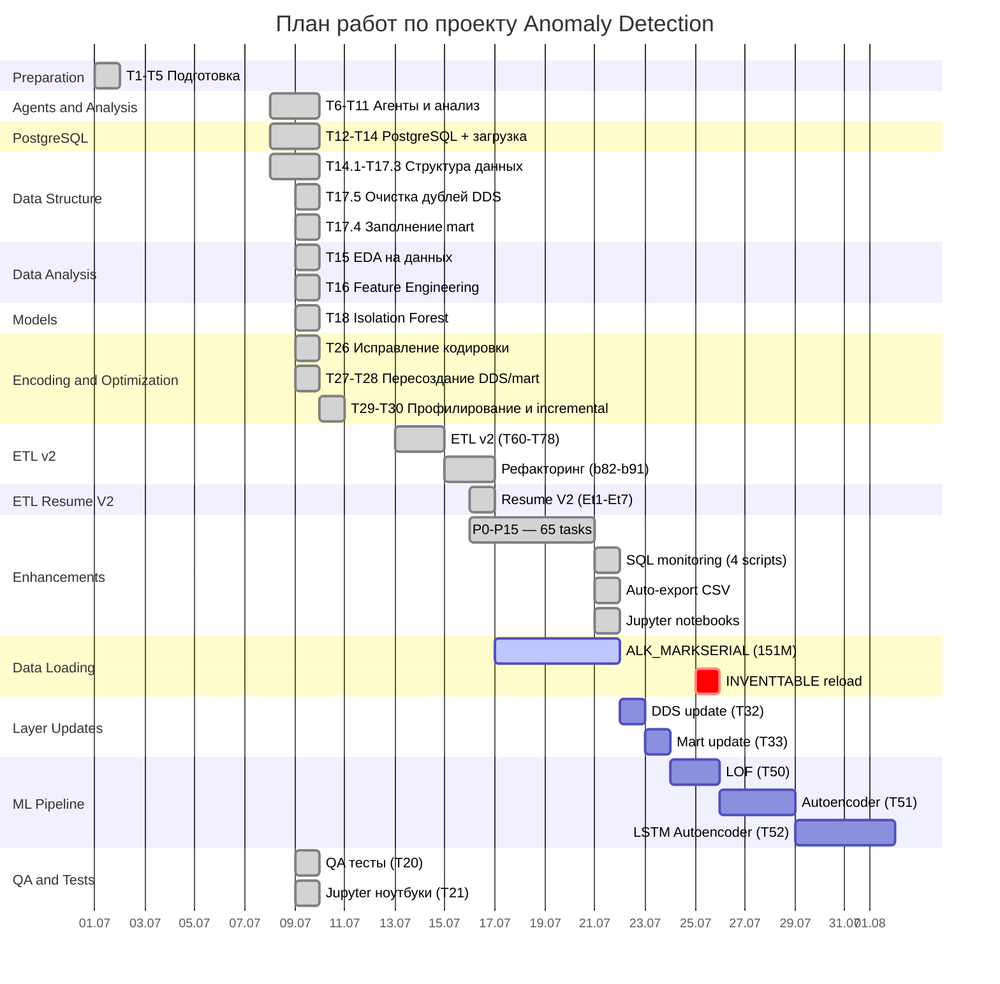

# Дорожная карта проекта

**Обновлено:** 2026-07-21

---

## Диаграмма Ганта

```
Задача                            Статус     %     Дедлайн
─────────────────────────────────────────────────────────────────────
T1-T5  Подготовка                 DONE      100   2026-07-01
T6-T11 Агенты и анализ            DONE      100   2026-07-08
T12-T14 PostgreSQL + загрузка     DONE      100   2026-07-08
T14.1-T17.3 Структура данных     DONE      100   2026-07-08
T17.5 Очистка дублей DDS         DONE      100   2026-07-09
T17.4 Заполнение mart             DONE      100   2026-07-09
T15  EDA на данных                DONE      100   2026-07-09
T16  Feature Engineering           DONE      100   2026-07-09
T18  Isolation Forest              DONE      100   2026-07-09
T20  Тесты                         DONE      100   2026-07-09
T21  Jupyter-ноутбуки              DONE      100   2026-07-09
T26  Исправление кодировки         DONE      100   2026-07-09
T27  Пересоздание DDS              DONE      100   2026-07-09
T28  Пересоздание mart             DONE      100   2026-07-09
T29  Профилирование таблиц AX      DONE      100   2026-07-10
T30  Инкрементальная загрузка       DONE      100   2026-07-10
T34  Benchmark fetch                DONE      100   2026-07-12
T60-T78 ETL v2                     DONE      100   2026-07-13
b82-b91 Рефакторинг                DONE      100   2026-07-15
ETL Resume V2                      DONE      100   2026-07-16
P0-P15 Enhancements                DONE      100   2026-07-21
SQL Monitoring                     DONE      100   2026-07-21
Auto-export CSV                    DONE      100   2026-07-21
Jupyter Notebooks                  DONE      100   2026-07-21
─────────────────────────────────────────────────────────────────────
T31  ALK_MARKSERIAL загрузка       ACTIVE    70%   2026-07-25
T32  DDS update                    TODO      0     2026-07-26
T33  Mart update                   TODO      0     2026-07-26
T50  LOF                           TODO      0     2026-07-28
T51  Autoencoder                   TODO      0     2026-07-31
T52  LSTM Autoencoder              TODO      0     2026-08-04
```

---

## Mermaid-диаграмма



---

## Критический путь

```
T1-T5 → T12-T14 → T17.5 → T15 → T16 → T18 → T60-T78 → Resume V2 → P0-P15 → T31 → T32 → T33 → T50
[DONE]   [DONE]    [DONE]  [DONE] [DONE] [DONE]  [DONE]     [DONE]      [DONE]  [ACTIVE] [TODO] [TODO] [TODO]
```

**Текущий этап:** T31 — загрузка ALK_MARKSERIAL (70%)

---

## Фазы проекта

### Фаза 1: Подготовка данных ✅ (100%)

| Задача | Статус | Дата |
|--------|--------|------|
| T1-T5 Подготовка | ✅ DONE | 2026-07-01 |
| T6-T11 Агенты и анализ | ✅ DONE | 2026-07-08 |
| T12-T14 PostgreSQL | ✅ DONE | 2026-07-08 |
| T14.1-T17.3 Структура данных | ✅ DONE | 2026-07-08 |
| T17.5 Очистка дублей | ✅ DONE | 2026-07-09 |
| T17.4 Заполнение mart | ✅ DONE | 2026-07-09 |

### Фаза 2: Анализ и модели ✅ (100%)

| Задача | Статус | Дата |
|--------|--------|------|
| T15 EDA | ✅ DONE | 2026-07-09 |
| T16 Feature Engineering | ✅ DONE | 2026-07-09 |
| T18 Isolation Forest | ✅ DONE | 2026-07-09 |
| T20 Тесты | ✅ DONE | 2026-07-09 |
| T21 Jupyter | ✅ DONE | 2026-07-09 |

### Фаза 3: ETL и оптимизация ✅ (100%)

| Задача | Статус | Дата |
|--------|--------|------|
| T26-T28 Кодировка + DDS/mart | ✅ DONE | 2026-07-09 |
| T29-T30 Профилирование | ✅ DONE | 2026-07-10 |
| T34 Benchmark | ✅ DONE | 2026-07-12 |
| T60-T78 ETL v2 | ✅ DONE | 2026-07-13 |
| b82-b91 Рефакторинг | ✅ DONE | 2026-07-15 |
| ETL Resume V2 | ✅ DONE | 2026-07-16 |
| P0-P15 Enhancements | ✅ DONE | 2026-07-21 |
| SQL Monitoring | ✅ DONE | 2026-07-21 |
| Auto-export CSV | ✅ DONE | 2026-07-21 |
| Jupyter Notebooks | ✅ DONE | 2026-07-21 |

### Фаза 4: Загрузка данных ⏳ (70%)

| Задача | Статус | Прогресс |
|--------|--------|----------|
| ALK_MARKSERIAL (151M) | ⏳ ACTIVE | 70% (~107M строк) |
| INVENTTABLE reload | ⏳ TODO | 60.6% (требует reload) |
| WMSORDERTRANS | ⏳ TODO | 81% (ошибка сети) |

### Фаза 5: Обновление слоёв 📋 (0%)

| Задача | Статус | Дедлайн |
|--------|--------|---------|
| T32 DDS update | 📋 TODO | После загрузки |
| T33 Mart update | 📋 TODO | После T32 |

### Фаза 6: ML Pipeline 📋 (0%)

| Задача | Статус | Дедлайн |
|--------|--------|---------|
| T50 LOF | 📋 TODO | 2026-07-28 |
| T51 Autoencoder | 📋 TODO | 2026-07-31 |
| T52 LSTM Autoencoder | 📋 TODO | 2026-08-04 |

---

## Прогресс по фазам

```
Фаза 1: Подготовка данных     ████████████████████ 100%
Фаза 2: Анализ и модели      ████████████████████ 100%
Фаза 3: ETL и оптимизация    ████████████████████ 100%
Фаза 4: Загрузка данных      ██████████████░░░░░░  70%
Фаза 5: Обновление слоёв     ░░░░░░░░░░░░░░░░░░░░   0%
Фаза 6: ML Pipeline          ░░░░░░░░░░░░░░░░░░░░   0%
───────────────────────────────────────────────────
Общий прогресс                ███████████████░░░░░░  82%
```

---

## Метрики проекта

| Метрика | Значение |
|---------|----------|
| Всего задач | 50+ |
| Выполнено | 40+ |
| В работе | 1 (T31) |
| Не начато | 9 |
| Готовность | 82% |
| Python модулей | 80 |
| Строк кода (ETL) | 17,048 |
| Тестов | 68 |
| SQL-скриптов | 32 |
| Ноутбуков | 13 |

---

## Риски

| Риск | Вероятность | Влияние | Митигация |
|------|-------------|---------|-----------|
| Загрузка ALK_MARKSERIAL слишком долгая | Средняя | Среднее | Параллельные workers, оптимизация |
| Сетевые ошибки SQL Server | Средняя | Среднее | Retry с backoff, heartbeat |
| Ошибки writer | Низкая | Высокое | P0-P15: атомарная фиксация |
| Нехватка памяти | Низкая | Среднее | Streaming COPY, batch processing |

---

## Технологический стек

| Компонент | Технология |
|-----------|------------|
| Язык | Python 3.13 |
| БД источник | SQL Server (AX2012) |
| БД назначения | PostgreSQL 17 |
| ETL | ParallelLoaderV2 / V2T |
| Мониторинг | SQL-скрипты + Jupyter |
| Тестирование | pytest (68 тестов) |
| Визуализация | matplotlib, seaborn |
| Экспорт | CSV, JSON, HTML, PDF, Excel |
