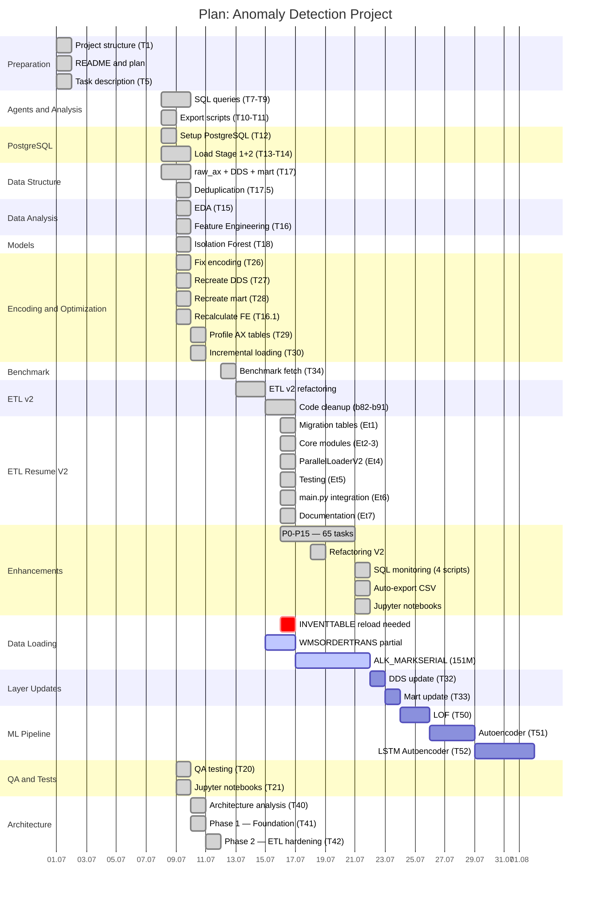

# Диаграмма Ганта

**Обновлено:** 2026-07-21



## Статус задач

| Задача | Статус | Дата |
|--------|--------|------|
| T1-T21 | ✅ Готово | 2026-07-01 - 2026-07-09 |
| T26-T30 | ✅ Готово | 2026-07-09 - 2026-07-10 |
| T34 | ✅ Готово | 2026-07-12 |
| T60-T78 | ✅ Готово | 2026-07-13 - 2026-07-14 |
| b82-b91 | ✅ Готово | 2026-07-15 |
| **ETL Resume V2** | ✅ **Готово** | **2026-07-16** |
| **P0-P15 Enhancements** | ✅ **Готово** | **2026-07-16 - 2026-07-21** |
| **SQL Monitoring** | ✅ **Готово** | **2026-07-21** |
| **Auto-export CSV** | ✅ **Готово** | **2026-07-21** |
| **Jupyter Notebooks** | ✅ **Готово** | **2026-07-21** |
| INVENTTABLE | ⚠️ Требует reload | 634,248 / 1,047,184 (60.6%) |
| WMSORDERTRANS | ⏳ Частично (ошибка сети) | ~37M / 45.7M (~81%) |
| ALK_MARKSERIAL | ⏳ Загружается (run 19) | ~107M / 151M (~70%) |
| T32 (DDS) | 📋 Ожидает | После загрузки |
| T33 (Mart) | 📋 Ожидает | После T32 |
| T50-T52 (ML) | 📋 Ожидает | После T33 |

## P0-P15 Enhancements — Детали

| Приоритет | Задачи | Тесты | Статус |
|-----------|--------|-------|--------|
| P0 | Протокол сообщений, staging, атомарность | 14 | ✅ |
| P1 | Recovery, RECID, PG per worker | 0 | ✅ |
| P2 | Preflight перед TRUNCATE | 0 | ✅ |
| P3 | Сетевые ретраи, supervisor, верификация | 0 | ✅ |
| P4 | Прогресс %, тесты P3, config YAML, PG pool | 8 | ✅ |
| P5 | Streaming COPY, max_attempts, отчёт | 0 | ✅ |
| P6 | Streaming threshold, jitter, метрики | 0 | ✅ |
| P7 | Health checks, shutdown, память | 0 | ✅ |
| P8 | Dead letter, HTML report, audit | 0 | ✅ |
| P9 | Profiler, quality checks, scheduler | 0 | ✅ |
| P10 | Metrics exporter, load retry, auto-tune | 0 | ✅ |
| P11 | Webhook, compression, incremental | 0 | ✅ |
| P12 | CLI, query cache, Grafana | 30 | ✅ |
| P13 | Connection pool, batch retry, config validator | 0 | ✅ |
| P14 | Pipeline orchestrator, load balancer, Excel | 0 | ✅ |
| P15 | Job queue, dependency graph, lineage, PDF | 0 | ✅ |
| **Итого** | **65 задач** | **68 тестов** | ✅ |

## Критический путь

```
ETL v2 ✅ → Refactoring ✅ → Resume V2 ✅ → P0-P15 ✅ → SQL мониторинг ✅ → Jupyter ✅ → Load tables → DDS → Mart → LOF → Autoencoder
[DONE]        [DONE]         [DONE]         [DONE]       [DONE]           [DONE]      [IN PROGRESS] [TODO] [TODO] [TODO]  [TODO]
```

## Прогресс

```
[████████████████████████████████████████████░] 98%
```

## Технический статус

| Компонент | Статус |
|-----------|--------|
| ETL v2 (T60-T78) | ✅ Завершён |
| Рефакторинг (b82-b91) | ✅ Завершён |
| **ETL Resume V2** | ✅ Готов к использованию |
| **P0-P15 Enhancements** | ✅ Завершены (34 модуля) |
| **SQL Monitoring** | ✅ 4 скрипта |
| **Auto-export CSV** | ✅ Настроен |
| **Jupyter Notebooks** | ✅ 2 ноутбука |
| Unit тесты | ✅ 68/68 пройдены |
| Signal handling | ✅ Реализован (P7) |
| Resume после crash | ✅ Реализован (v2) |

## Использование

```cmd
# V2 (оригинал с рефакторингом)
python -m ax_to_postgres_etl.main --use-v2 --table ALK_MARKSERIAL --mode resume

# V2T (P0-P15 enhancements)
python -m ax_to_postgres_etl.main --use-v2t --table ALK_MARKSERIAL --mode resume

# Авто-экспорт CSV (ежечасно)
powershell -ExecutionPolicy Bypass -File export_completed_chunks.ps1

# SQL-мониторинг
psql -h localhost -U postgres -d wms_analysis -f ax_to_postgres_etl/etl_monitoring/etl_monitor_fast.sql
```

## Последние события

| Дата | Событие |
|------|---------|
| 2026-07-21 | SQL-мониторинг (4 скрипта) создан |
| 2026-07-21 | Авто-экспорт CSV настроен |
| 2026-07-21 | Jupyter ноутбуки созданы |
| 2026-07-21 | Баг table_config исправлен |
| 2026-07-21 | Баг case sensitivity исправлен |
| 2026-07-21 | Баг start_threads исправлен |
| 2026-07-21 | P0-P15 завершены, рефакторинг V2 применён |
| 2026-07-18 | Зависание writer исправлено (heartbeat в отдельном потоке) |
| 2026-07-16 | **ETL Resume V2 завершён** — готов к использованию |
| 2026-07-16 | P0-P15: 65 задач, 68 тестов, 34 модуля |
| 2026-07-15 | b82-b91 рефакторинг завершён |
