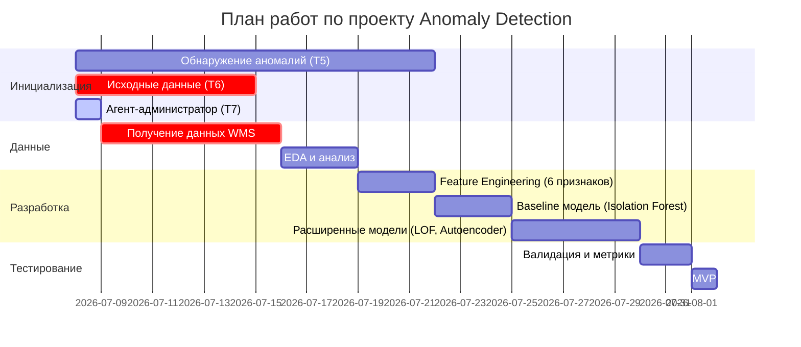

# Диаграмма Ганта

```mermaid
gantt
    title План работ по проекту Anomaly Detection
    dateFormat  YYYY-MM-DD

    section Инициализация
    Обнаружение аномалий (T5)              :         t5, 2026-07-08, 14d
    Исходные данные (T6)                   :crit,    t6, 2026-07-08, 7d
    Агент-администратор (T7)               :active,  t7, 2026-07-08, 1d

    section Данные
    Получение данных WMS                   :crit,    t_data, 2026-07-09, 7d
    EDA и анализ                           :         t_eda, after t_data, 3d

    section Разработка
    Feature Engineering (6 признаков)      :         t_feat, after t_eda, 3d
    Baseline модель (Isolation Forest)     :         t_base, after t_feat, 3d
    Расширенные модели (LOF, Autoencoder)  :         t_adv, after t_base, 5d

    section Тестирование
    Валидация и метрики                    :         t_val, after t_adv, 2d
    MVP                                    :         t_mvp, after t_val, 1d
```
