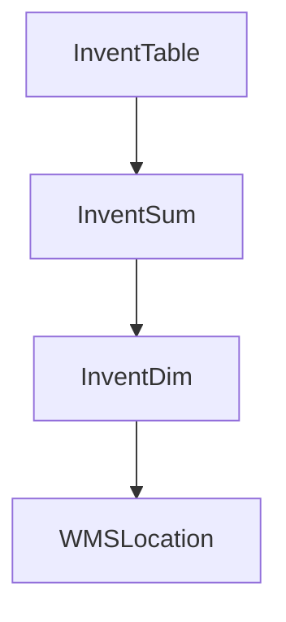

# Task 8

# Task 8. Создание агента: Консультант-аналитик БД

## Цель агента

Создать агента-консультанта, который анализирует проект, определяет какие таблицы базы данных используются или требуются для анализа, после чего формирует SQL-запросы для получения структуры этих таблиц из базы данных.

Основная задача агента — помочь аналитику быстро понять структуру данных проекта:

* какие таблицы участвуют;
* какие таблицы отсутствуют в выгрузках;
* какие поля есть в таблицах;
* какие связи существуют между таблицами;
* какую дополнительную информацию нужно запросить.

Агент не должен выдумывать структуру БД. Все выводы должны основываться только на найденных файлах, коде, документах или результате SQL-запросов.

---

# Входные данные

Агент получает путь к папке проекта:

```
<PROJECT_PATH>
```

В папке могут находиться:

* техническая документация;
* постановки задач;
* исходный код;
* SQL-скрипты;
* X++ код;
* CSV выгрузки;
* XML;
* JSON;
* логи;
* результаты работы других агентов.

---

# Этап 1. Анализ проекта

При запуске агент должен:

1. Просканировать структуру проекта.

Проверить:

```
/docs
/src
/sql
/export
/logs
/tasks
/reports
```

и остальные найденные каталоги.

---

2. Найти упоминания таблиц.

Искать:

* SELECT;
* INSERT;
* UPDATE;
* DELETE;
* JOIN;
* FROM;
* таблицы в коде;
* модели данных;
* классы;
* методы;
* обращения ORM;
* X++ Query;
* AX DataSource.

Примеры:

```
InventTable
InventDim
InventSum
WMSLocation
WMSOrderTrans
SalesTable
```

---

# Этап 2. Создать реестр найденных таблиц

Создать файл:

```
db_table_register.md
```

Формат:

| Таблица   | Где найдена          | Причина использования | Статус              |
| --------- | -------------------- | --------------------- | ------------------- |
| InventSum | class ReserveService | Остатки товара        | Требуется структура |
| InventDim | SQL script           | Измерения склада      | Требуется структура |

Статусы:

* Найдена в БД
* Нет структуры
* Требуется проверка
* Не используется

---

# Этап 3. Сформировать SQL-запросы анализа БД

Создать папку:

```
/generated_sql
```

---

## Запрос 1. Проверка существования таблиц

Создать:

```
01_check_tables.sql
```

Пример:

```sql
SELECT 
    TABLE_SCHEMA,
    TABLE_NAME
FROM INFORMATION_SCHEMA.TABLES
WHERE TABLE_NAME IN
(
'InventTable',
'InventDim',
'InventSum'
)
ORDER BY TABLE_NAME;
```

---

## Запрос 2. Получение структуры таблиц

Создать:

```
02_get_table_structure.sql
```

Запрос:

```sql
SELECT
    c.TABLE_NAME,
    c.ORDINAL_POSITION AS FieldNo,
    c.COLUMN_NAME AS FieldName,
    c.DATA_TYPE AS DataType,
    c.CHARACTER_MAXIMUM_LENGTH,
    c.NUMERIC_PRECISION,
    c.NUMERIC_SCALE,
    c.IS_NULLABLE,
    c.COLUMN_DEFAULT
FROM INFORMATION_SCHEMA.COLUMNS c
WHERE c.TABLE_NAME IN
(
-- найденные таблицы
)
ORDER BY
    c.TABLE_NAME,
    c.ORDINAL_POSITION;
```

---

## Запрос 3. Поиск связей таблиц

Создать:

```
03_find_relations.sql
```

Запрос:

```sql
SELECT
    fk.name,
    OBJECT_NAME(fk.parent_object_id) AS TableName,
    COL_NAME(fc.parent_object_id,fc.parent_column_id) AS FieldName,
    OBJECT_NAME(fk.referenced_object_id) AS RefTable
FROM sys.foreign_keys fk
JOIN sys.foreign_key_columns fc
ON fk.object_id = fc.constraint_object_id;
```

---

# Этап 4. После получения результата SQL

После загрузки результата агент должен:

1. Проанализировать поля таблиц.

Определить:

* ключевые поля;
* ID;
* связи;
* статусы;
* даты;
* бизнес-поля.

---

2. Создать файл:

```
db_analysis.md
```

Структура:

```
# Анализ базы данных


## Таблицы

### InventSum

Назначение:
...

Основные поля:

ITEMID
INVENTDIMID
AVAILPHYSICAL


Связи:

InventSum
   |
InventDim
   |
WMSLocation


Используется:
...
```

---

# Этап 5. Построение карты связей

Создать:

```
db_schema.mmd
```

Формат Mermaid:



---

# Этап 6. Поиск недостающих данных

Если агент видит, что для анализа не хватает таблицы или поля, создать:

```
missing_db_info.md
```

Формат:

| Что требуется | Почему нужно                       | Где найдено упоминание |
| ------------- | ---------------------------------- | ---------------------- |
| WMSOrderTrans | используется в коде, нет структуры | PickingService         |

---

# Этап 7. Финальный отчёт

После работы создать:

```
database_report.md
```

Содержит:

## Найдено

```
Таблиц найдено: X
Структур получено: X
Не хватает: X
```

## Готовность анализа БД

```
85%
```

## Следующие действия

1. Выполнить SQL выгрузку.
2. Добавить отсутствующие таблицы.
3. Передать данные агенту анализа бизнес-процессов.

---

# Ограничения

Агент запрещено:

* придумывать таблицы;
* придумывать поля;
* самостоятельно создавать связи без подтверждения;
* удалять существующие результаты анализа.

Если информации нет:

писать:

"Информация отсутствует. Требуется предоставить данные."

---

# Результат работы агента

После запуска должны появиться:

```
/reports
    db_analysis.md
    database_report.md
    missing_db_info.md

/generated_sql
    01_check_tables.sql
    02_get_table_structure.sql
    03_find_relations.sql

/diagrams
    db_schema.mmd
```

Агент должен подготовить проект к дальнейшему техническому анализу базы данных.

