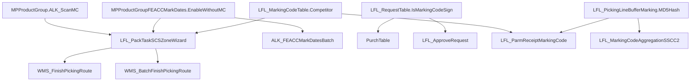

# Рекомендации по анализу функционала WMS

## Источник
Анализ 12 XPO-файлов SharedProject ALK_WMS
Матрица признаков и поведение системы WMS

---

## Содержание

1. [Приоритет 1 — Текущий долг](#1-приоритет-1--текущий-долг)
2. [Приоритет 2 — Качество кода](#2-приоритет-2--качество-кода)
3. [Приоритет 3 — Эксплуатация](#3-приоритет-3--эксплуатация)
4. [Приоритет 4 — Документирование](#4-приоритет-4--документирование)
5. [Конкретные скрипты](#5-конкретные-скрипты)

---

## 1. Приоритет 1 — Текущий долг

### 1.1. Генерация тест-кейсов по матрице признаков

**Цель:** Автоматическая генерация тест-кейсов для 8 комбинаций (ОСУ × Маркируемый × КМ на заявке).

**Вход:** Матрица из `МАТРИЦА_ПРИЗНАКОВ_И_ПОВЕДЕНИЕ_СИСТЕМЫ.docx`

**Выход:** Табличный набор тест-кейсов для XUnit/AxE

| # | ОСУ | Маркируемый | КМ на заявке | Допустимые коды | Ожидаемая ошибка |
|---|-----|-------------|--------------|-----------------|------------------|
| 1 | Да | Да | Да | SSCC, ШК упаковки, КМ | — |
| 2 | Да | Да | Нет | SSCC, ШК упаковки | — |
| 3 | Да | Нет | Да | SSCC, ШК упаковки, ШК номенклатуры | — |
| 4 | Да | Нет | Нет | SSCC, ШК упаковки | — |
| 5 | Нет | Да | Да | SSCC, ШК упаковки, КМ | — |
| 6 | Нет | Да | Нет | SSCC, ШК упаковки, КМ | — |
| 7 | Нет | Нет | Да | ШК номенклатуры, SSCC | — |
| 8 | Нет | Нет | Нет | ШК номенклатуры, SSCC | — |

**Дополнительные переменные:**
- `NoScanMC` (Да/Нет)
- `ALK_ScanMC` (Да/Нет)
- `EnableWithoutMC` (Да/Нет)
- `AllowPieceControl` (значение порога)
- `ServMAGNITKI` (Да/Нет)
- `OurShop` (Да/Нет)

**Итого:** 8 × 2⁶ = 512 комбинаций (полная матрица)

**Метод генерации:**
```
Для каждой комбинации признаков:
  1. Определить входные данные (товар, заявка, настройки ТГ)
  2. Определить ожидаемое поведение (какие коды допустимы)
  3. Определить шаги проверки (7-шаговый алгоритм КМ)
  4. Сгенерировать XUnit-класс с методом [Test]
```

---

### 1.2. Анализ покрытия кода

**Цель:** Определить, какие ветки `if/switch` в ключевых методах не покрыты тестами.

**Ключевые методы для анализа:**

| Метод | Файл | Количество ветвей | Приоритет |
|-------|------|-------------------|-----------|
| `LFL_ItemMarkingCodeHelper::encode()` | DAX-008712 | 6 | Высокий |
| `LFL_PackTaskSCSZoneWizard::checkCanClose()` | DAX-012371 | 4 | Высокий |
| `LFL_MarkingCodeAggregationSSCC2::checkMarkingCode()` | DAX-011157 | 8 | Средний |
| `LFL_MsgReqDirectProcessing_MarkSerial::run()` | DAX-011002 | 5 | Средний |
| `MPProductGroupFEACCMarkDates::checkEnableWithoutMC()` | DAX-009806 | 2 | Низкий |

**Пример ветвей для `encode()`:**
```xpp
// 1. productGroup == null → ошибка
// 2. productGroup есть, но нет шаблона → ошибка
// 3. КМ содержит символ 29 (GS) → парсинг через шаблон
// 4. КМ не содержит символ 29 → ошибка формата
// 5. gtin найден → поиск ItemId
// 6. gtin не найден → ошибка
```

**Метод анализа:**
1. Экспортировать покрытие кода из AOT (если доступен)
2. Или: ручной аудит по списку ветвей
3. Сравнить с существующими тестами в XUnit

---

### 1.3. Анализ цепочки вызовов (Call Graph)

**Цель:** Построить граф вызовов для критичных сценариев.

**Сценарий 1: Сканирование КМ**
```
editMarkingCode(_markingCode)
  └─ checkMarkingCode(_markingCode)
       └─ LFL_ItemMarkingCodeHelper::constructMarkingCode()
            └─ encode()
                 ├─ MPProductGroup::findByCode()
                 ├─ productGroup.MPCisTemplate().cisSegmentEngine().segment(GTIN)
                 ├─ productGroup.MPCisTemplate().cisSegmentEngine().segment(SERIAL)
                 └─ LFL_MarkingCodeTable::findByGTIN()
  └─ addMarkingCode(_markingCode)
       └─ tmpItemSerialTable.insert()
```

**Сценарий 2: Сканирование ШК**
```
editItemBarCode(_barCode)
  └─ checkMarkingCode(_barCode)
       ├─ Маркируемый товар?
       │   ├─ Да + NoScanMC=Нет → ОШИБКА: Требуется КМ
       │   ├─ Да + NoScanMC=Да → OK (ШК разрешён)
       │   └─ Нет → Продолжить
       ├─ ОСУ?
       │   ├─ Да + ServMAGNITKI → Только SSCC/ШК упаковки
       │   ├─ Да + AllowPieceControl=Да → Поштучно
       │   └─ Нет → Продолжить
       ├─ ALK_ScanMC=Да? → ОШИБКА: Требуется КМ
       ├─ Тип грузоместа? → Заводская упаковка
       └─ EnableWithoutMC=Да? → Допуск без КМ
```

**Сценарий 3: Завершение маршрута**
```
WMS_FinishPickingRoute::run()
  └─ Проверка ProblemKM
       ├─ Есть записи → Диалог
       │   ├─ Подтверждение → Перемещение в ячейку пере-маркировки
       │   └─ Отмена → Возврат к контролю
       └─ Нет → Завершение
```

---

## 2. Приоритет 2 — Качество кода

### 2.1. Статический анализ X++ кода

**Цель:** Найти проблемы качества в 12 XPO-файлах.

**Проверки:**

| Проверка | Описание | Файлы для проверки |
|----------|----------|-------------------|
| **Мёртвый код** | Закомментированные блоки `/* ... */` | Все 12 файлов |
| **Дублирование** | Одинаковый код в разных файлах | `LFL_PackTaskSCSZoneWizard` (6 файлов) |
| **Нарушения именования** | SUP-комментарии vs DAX-комментарии | Все файлы |
| **Потенциальные race conditions** | `ttsBegin/ttsCommit` без обработки ошибок | DAX-008712, DAX-011157 |
| **Магические числа** | Хардкод значений (18, 150, 130) | DAX-008712 (`#SSCCCodeLen`) |
| **Неиспользуемые переменные** | Объявленные, но не используемые | Все файлы |

**Примеры мёртвого кода (DAX-008712):**
```xpp
// Закомментированные блоки:
// - Проверка уровня SSCC (строки 335-348)
// - Проверка наличия содержимого (строки 351-365)
// - Воспроизведение звука (строки 116-120)
```

**Пример дублирования:**
```
LFL_PackTaskSCSZoneWizard встречается в:
- DAX-009612 (checkCanClose)
- DAX-009806 (checkCanClose)
- DAX-010595 (checkCanClose, distributeProblemKMQty)
- DAX-011002 (checkCanClose)
- DAX-011437 (checkCanClose)
- DAX-012371 (все методы)
```

---

### 2.2. Анализ зависимостей между объектами

**Цель:** Построить граф зависимостей для оценки blast radius изменений.

**Ключевые цепочки:**

| Объект | Зависит от | Зависимости |
|--------|-----------|-------------|
| `MPProductGroup.ALK_ScanMC` | — | `LFL_PackTaskSCSZoneWizard`, `WMS_FinishPickingRoute` |
| `MPProductGroupFEACCMarkDates.EnableWithoutMC` | `MPProductGroup`, `FEACCTable_RU` | `ALK_FEACCMarkDatesBatch`, `LFL_PackTaskSCSZoneWizard` |
| `LFL_RequestTable.IsMarkingCodeSign` | — | `PurchTable`, `LFL_ApproveRequest`, `WMS_WMSJournalHandler` |
| `LFL_MarkingCodeTable.Competitor` | `ALK_MarkSerial` | `LFL_ParmReceiptMarkingCode`, `LFL_PackTaskSCSZoneWizard` |
| `LFL_PickingLineBufferMarking.MD5Hash` | — | `LFL_ParmReceiptMarkingCode`, `LFL_MarkingCodeAggregationSSCC2` |

**Граф зависимостей (Mermaid-синтаксис):**


**Применение:** При изменении любого объекта — автоматически определять, какие формы/классы нужно проверить.

---

### 2.3. Анализ миграционных данных

**Цель:** Проверить безопасность и обратимость миграций.

**Доступные Job'и:**

| Job | Файл | Описание |
|-----|------|----------|
| `ALK_WMS_DAX_010595_jane_1` | DAX-010595 | Миграция данных для обработки некорректных КМ |
| `ALK_WMS_DAX_010595_jane_2` | DAX-010595 | Продолжение миграции |

**Проверки:**
1. **Объём данных:** Сколько записей затрагивается?
2. **Обратимость:** Есть ли rollback-логика?
3. **Производительность:** Время выполнения при N записях?
4. **Целостность:** Есть ли проверки после миграции?

---

## 3. Приоритет 3 — Эксплуатация

### 3.1. Мониторинг ключевых метрик

**Цель:** Настроить джоб для сбора статистики по функционалу КМ/ШК.

**Метрики:**

| Метрика | Источник | Формула |
|---------|----------|---------|
| **Ошибка "Требуется КМ"** | `WMS_PickDiffActLine` | `COUNT(*) WHERE ActType = ProblemKM AND Reason = 'NoScanMC'` |
| **Доля ОСУ с допуском** | `MPProductGroupFEACCMarkDates` | `COUNT(*) WHERE EnableWithoutMC = Yes / COUNT(*)` |
| **Проблемные КМ** | `WMS_PickDiffActLine` | `SUM(DiffQtyForPick) WHERE ActType = ProblemKM` |
| **Конкуренция MP** | `LFL_MarkingCodeTable` | `COUNT(*) WHERE Competitor = Yes` |
| **Статус ГИС МТ** | `ALK_MarkSerial` | `COUNT(*) GROUP BY StatusExt` |
| **Сканирования по формам** | `WMS_JournalWarehouseOperationTable` | `COUNT(*) GROUP BY OperationType` |

**Частота:** Ежедневный джоб (ночной)

**Формат отчёта:** Табличный + графики тренда

---

### 3.2. Валидация настроек

**Цель:** Проверить консистентность настроек перед запуском в продакшен.

**Правила валидации:**

| # | Правило | Критичность |
|---|---------|-------------|
| 1 | Если `ALK_ScanMC=Да` для ТГ → должен быть настроен `ALK_MPCisTemplate` | Высокая |
| 2 | Если `EnableWithoutMC=Да` → должна быть задана `InternalForbidenTurnoverDate` | Высокая |
| 3 | Если `NoScanMC=Да` → должен быть признак `OurShop` или `ServMAGNITKI` | Средняя |
| 4 | Если `IsMarkingCodeSign=Да` → должна быть привязка к `PurchTable` | Средняя |
| 5 | Если `ReMarckingLocationId` не настроена → `ALK_ActivateRemarkingLocation` должен быть No | Низкая |

**Реализация:** X++ класс или SQL-запрос для проверки

---

### 3.3. Анализ производительности

**Цель:** Определить узкие места в ключевых запросах.

**Критичные запросы:**

| Запрос | Файл | Проблема |
|--------|------|----------|
| `LFL_MarkingCodeTable::findByGTIN(gtin, serial)` | DAX-008712 | Поиск без индекса по `GTIN + ItemSerialNumber` |
| `SELECT WHERE MD5Hash = MPApiEngine::getHash(serial)` | DAX-010310-fix | Вычисление хеша на лету |
| `SELECT WHERE Competitor = Yes` | DAX-011437 | Фильтрация по флагу |
| `SELECT SUM(DiffQtyForPick) WHERE ActType = ProblemKM` | DAX-010595 | Агрегация без индекса |

**Рекомендации:**
1. Добавить индексы по `GTIN + ItemSerialNumber` в `LFL_MarkingCodeTable`
2. Кэшировать `MPApiEngine::getHash()` для частых серийных номеров
3. Добавить индекс по `Competitor + ItemId` в `LFL_MarkingCodeTable`
4. Добавить индекс по `ActType + LFL_SCSPackTaskId` в `WMS_PickDiffActLine`

---

## 4. Приоритет 4 — Документирование

### 4.1. Генерация Swagger/OpenAPI для TSD Android

**Цель:** Автоматически сгенерировать документацию API для мобильного терминала.

**Вход:** 7 форм комплектации из `МАТРИЦА_ПРИЗНАКОВ_И_ПОВЕДЕНИЕ_СИСТЕМЫ.docx`

**Выход:** OpenAPI 3.0 спецификация

**Формы для документирования:**

| Форма | Endpoint | Метод |
|-------|----------|-------|
| Завершение маршрута | `/api/v1/picking-route/{id}/finish` | POST |
| Выдача заданий на упаковку | `/api/v1/pack-task/{id}/assign` | POST |
| Одноштучные заказы | `/api/v1/pack-task/{id}/scan` | POST |
| Произвольные задания | `/api/v1/pack-task/{id}/scan` | POST |
| Негабарит IM | `/api/v1/pack-task/{id}/scan-oversized` | POST |
| Мастер размещения | `/api/v1/placement/{id}/scan` | POST |
| Агрегация | `/api/v1/aggregation/{id}/scan` | POST |

**Для каждого endpoint:**
- Входные параметры (тип кода, значение)
- Допустимые коды (по матрице признаков)
- Ответы (успех/ошибка + код ошибки)

---

### 4.2. Каталог ошибок

**Цель:** Единый справочник всех ошибок системы с кодами, условиями и действиями.

| Код | Ошибка | Условие | Действие оператора |
|-----|--------|---------|--------------------|
| KM-001 | Требуется сканирование КМ | Маркируемый + NoScanMC=Нет | Отсканируйте КМ |
| KM-002 | КМ отсутствует на складе | КМ не найден в базе | Отложите товар |
| KM-003 | КМ не Введён в оборот | Статус ГИС МТ ≠ INTRODUCED | Отложите, дождитесь ввода |
| KM-004 | КМ заблокирован | Blocked=Yes | Обратитесь к руководителю |
| KM-005 | Конкурентный MP | RefШК не найден | Обратитесь к руководителю |
| KM-006 | КМ уже добавлен | Дубликат в сессии | Отсканируйте другой КМ |
| KM-007 | Собственник отличается | ExtOwnerName ≠ ранее агрегированных | Отложите товар |
| OSU-001 | Поштучный контроль запрещён | ОСУ + AllowPieceControl=Нет | Отсканируйте SSCC/ШК |
| OSU-002 | ШК упаковки с Магниткой запрещён | ServMAGNITKI + Маркируемый | Отсканируйте SSCC |
| OSU-003 | Не должно быть КМ | Поставка без КМ | Отсканируйте ШК |
| SSCC-001 | Некорректная длина SSCC | Длина ≠ 18/20 | Проверьте код |
| SSCC-002 | SSCC уже используется | Найден в LFL_SSCCTable | Используйте другой |

---

## 5. Конкретные скрипты

### 5.1. Скрипт генерации тест-кейсов (Python)

```python
# Генерация тест-кейсов по матрице признаков
features = {
    'OSU': [True, False],
    'Markable': [True, False],
    'KMOnRequest': [True, False],
    'NoScanMC': [True, False],
    'ALK_ScanMC': [True, False],
    'EnableWithoutMC': [True, False],
    'AllowPieceControl': [0, 100],
    'ServMAGNITKI': [True, False],
    'OurShop': [True, False],
}

# Каждая комбинация → тест-кейс
for osu in features['OSU']:
    for markable in features['Markable']:
        for km_on_req in features['KMOnRequest']:
            # ... генерация XUnit-класса
```

### 5.2. Скрипт валидации настроек (X++)

```xpp
// Проверка консистентности настроек
class WMS_SettingsValidator
{
    void validate()
    {
        MPProductGroup tg;
        while select tg
        {
            // Правило 1: ALK_ScanMC → MPCisTemplate
            if (tg.ALK_ScanMC == NoYes::Yes && !tg.ALK_MPCisTemplate)
            {
                error(strFmt("ТГ %1: ALK_ScanMC=Да, но не настроен шаблон КМ", tg.GroupId));
            }
            
            // Правило 2: EnableWithoutMC → InternalForbidenTurnoverDate
            MPProductGroupFEACCMarkDates dates;
            select dates where dates.MPProductGroup == tg.RecId
                && dates.EnableWithoutMC == NoYes::Yes;
            if (dates && !dates.InternalForbidenTurnoverDate)
            {
                error(strFmt("ТГ %1: EnableWithoutMC=Да, но не задана дата запрета", tg.GroupId));
            }
        }
    }
}
```

### 5.3. Скрипт сбора метрик (SQL)

```sql
-- Ежедневная статистика по КМ
SELECT 
    CAST(StartDate AS DATE) AS dt,
    OperationType,
    COUNT(*) AS operation_count,
    SUM(Qty) AS total_qty
FROM WMS_JournalWarehouseOperationTable
WHERE StartDate >= DATEADD(day, -1, GETDATE())
GROUP BY CAST(StartDate AS DATE), OperationType
ORDER BY dt DESC;

-- Проблемные КМ за день
SELECT 
    LFL_SCSPackTaskId,
    ActType,
    COUNT(*) AS problem_count,
    SUM(DiffQtyForPick) AS problem_qty
FROM WMS_PickDiffActLine
WHERE ActType = 'ProblemKM'
    AND CreatedDateTime >= DATEADD(day, -1, GETDATE())
GROUP BY LFL_SCSPackTaskId, ActType;
```

---

## Приоритет выполнения

| # | Задача | Время | Сложность | Статус |
|---|--------|-------|-----------|--------|
| 1 | Генерация тест-кейсов | 2-3 дня | Средняя | К выполнению |
| 2 | Анализ покрытия кода | 1-2 дня | Низкая | К выполнению |
| 3 | Анализ цепочки вызовов | 1 день | Низкая | К выполнению |
| 4 | Статический анализ | 2-3 дня | Средняя | К выполнению |
| 5 | Анализ зависимостей | 1 день | Низкая | К выполнению |
| 6 | Анализ миграций | 1 день | Низкая | К выполнению |
| 7 | Мониторинг метрик | 2-3 дня | Средняя | К выполнению |
| 8 | Валидация настроек | 1 день | Низкая | К выполнению |
| 9 | Анализ производительности | 2-3 дня | Высокая | К выполнению |
| 10 | Генерация Swagger | 2-3 дня | Средняя | К выполнению |

**Итого:** 14-19 дней на полный анализ
