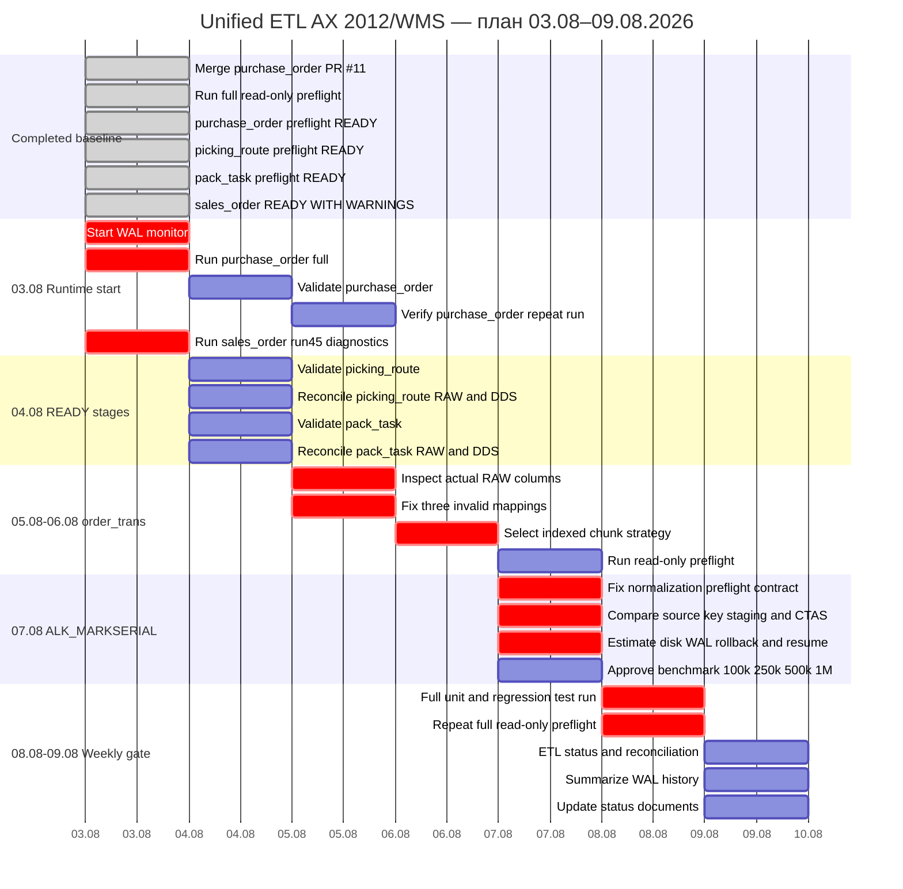

# ДИАГРАММА ГАНТА — UNIFIED ETL

**Обновлено:** 2026-08-03 14:25



## Текущий readiness

```text
READY:
- purchase_order
- picking_route
- pack_task

READY_WITH_WARNINGS:
- sales_order

BLOCKED:
- order_trans
- serial_mark_normalization
- serial_mark
```

## Фактические блокеры

```text
order_trans:
- recid text incompatible with numeric_range
- missing ordertransid
- missing pickedqty
- missing wastedqty
- missing recid_bigint index
- EXPLAIN references nonexistent recid_bigint

serial_mark_normalization:
- no columns mapping for current preflight contract

serial_mark:
- recid text incompatible with numeric_range
- no recid_bigint B-tree
- blocking Seq Scan on about 153.2M rows / 78.8 GB
- WAL risk HIGH
```

## Критический путь

```text
purchase_order runtime completion
→ sales_order run45 diagnosis
→ picking_route and pack_task validation
→ order_trans indexed design
→ serial_mark normalization contract
→ serial_mark architecture decision
→ weekly gate
```

## Условия перехода

- `purchase_order` закрывается только после COMPLETED run, validate-only и repeat-run проверки;
- `sales_order` не возобновляется до разбора run 45 и Bitmap Heap Scan;
- `picking_route` и `pack_task` требуют reconciliation, поскольку preflight использует оценочные counts;
- `order_trans` не запускается до исправления mapping и индексируемого chunk key;
- `serial_mark_normalization` не запускается до полноценного preflight;
- `serial_mark` не изменяет RAW массовым UPDATE;
- любой изменяющий запуск предваряется проверкой disk, WAL, activity, vacuum, index progress и locks.
