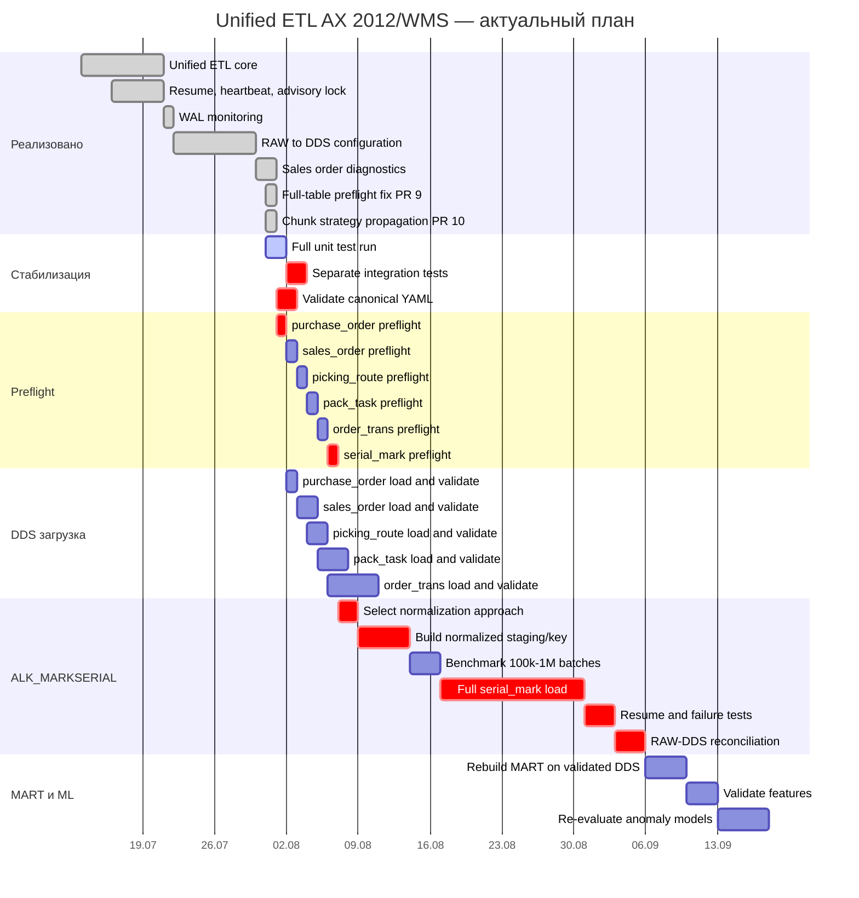

# ДИАГРАММА ГАНТА — UNIFIED ETL

**Обновлено:** 2026-07-31



## Критический путь

```text
Тесты → preflight → исправление blockers → нормализация ALK_MARKSERIAL
→ benchmark → полная загрузка dds.serial_mark → resume-тесты
→ сверка RAW/DDS → MART → ML
```

## Условия перехода между этапами

- к изменяющему запуску переходить только после успешного read-only preflight;
- загрузку следующего stage начинать после валидации conflict key и результата предыдущего;
- тяжёлую загрузку `serial_mark` запускать только после проверки диска, WAL, активных backend-процессов и индексов;
- MART и ML не считать актуальными до подтверждения полноты DDS.
