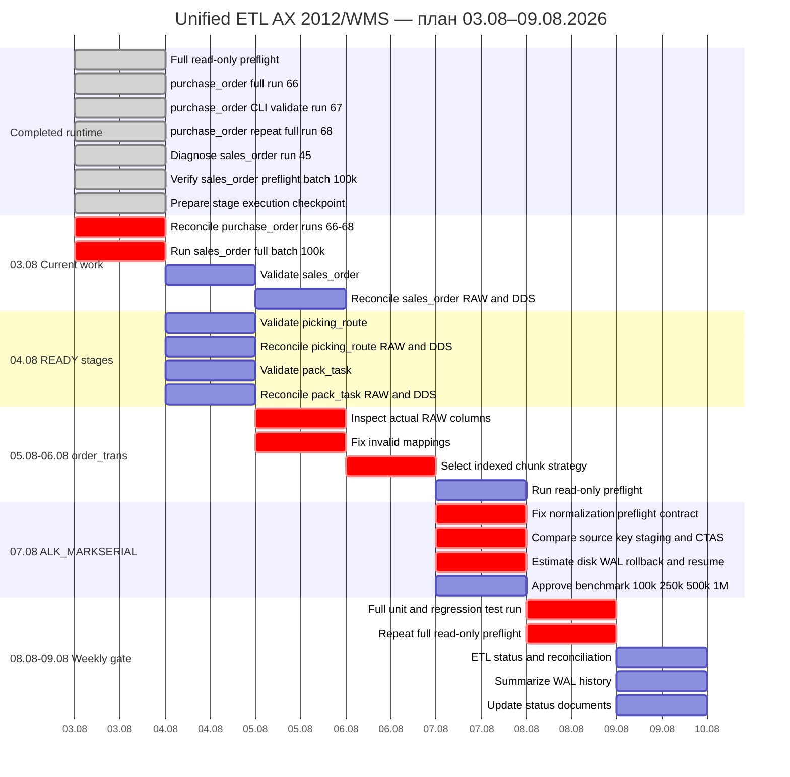

# ДИАГРАММА ГАНТА — UNIFIED ETL

**Обновлено:** 2026-08-03 16:02



## Текущий readiness

```text
RUNTIME COMPLETED:
- purchase_order

READY FOR NEW FULL RUN:
- sales_order

READY FOR VALIDATION:
- picking_route
- pack_task

BLOCKED:
- order_trans
- serial_mark_normalization
- serial_mark
```

## Подтверждённые факты

```text
purchase_order:
- run 66 completed
- run 67 completed under validate-only CLI label but used runtime path
- run 68 repeat full completed
- final reconciliation remains

sales_order:
- run 45 failed before chunks
- cause: missing PipelineSpec.chunk_strategy in old code path
- data impact: none
- resume is not required
- batch 100k preflight READY_WITH_WARNINGS
- Bitmap Heap Scan uses Bitmap Index Scan

implementation checkpoint:
- DB execution pending on Windows host
- validate-only fixed to a real read-only path
- reconciliation SQL and guarded PowerShell runner prepared
- order_trans and serial_mark staging mappings prepared
```

## Критический путь

```text
purchase_order reconciliation
→ sales_order full 100k
→ sales_order validation
→ picking_route and pack_task validation
→ order_trans indexed design
→ serial_mark normalization contract
→ serial_mark architecture decision
→ weekly gate
```

## Условия перехода

- `purchase_order` закрывается после точной reconciliation runs 66–68;
- `sales_order` запускается новым `full`, а не `resume` run 45;
- `picking_route` и `pack_task` требуют validate-only и reconciliation;
- `order_trans` не запускается до исправления mapping и индексируемого chunk key;
- `serial_mark_normalization` не запускается до полноценного preflight;
- `serial_mark` не изменяет RAW массовым UPDATE;
- любой изменяющий запуск предваряется проверкой disk, WAL, activity, vacuum, index progress и locks.
