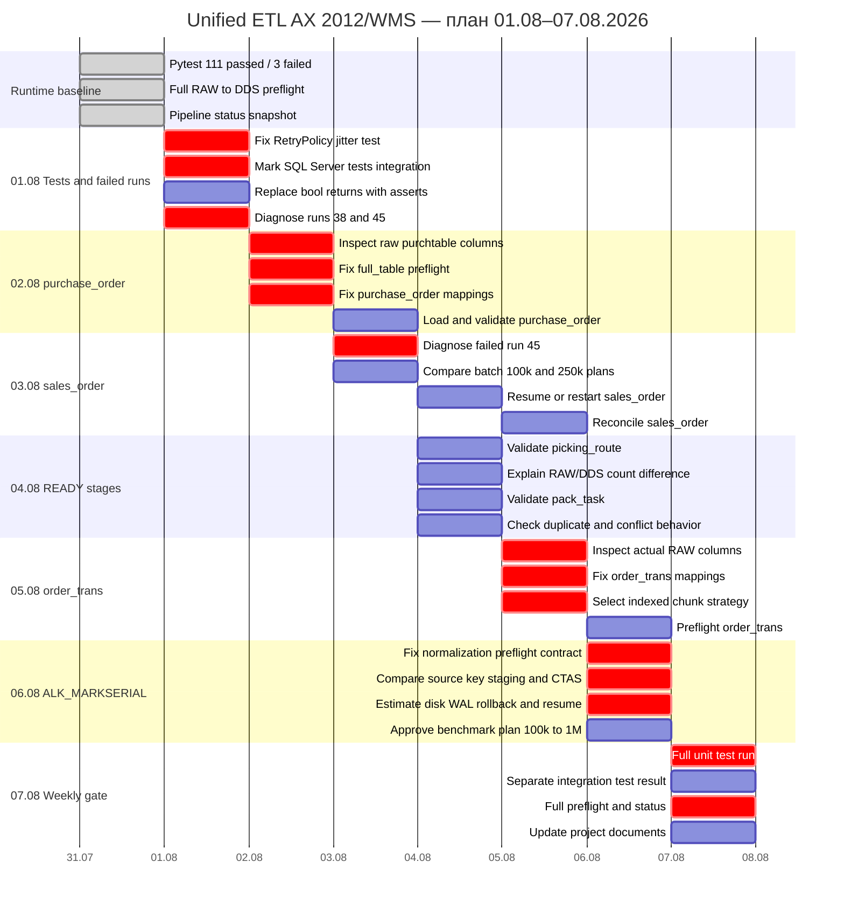

# ДИАГРАММА ГАНТА — UNIFIED ETL

**Обновлено:** 2026-07-31 19:24



## Текущий readiness

```text
READY:               picking_route, pack_task
READY_WITH_WARNINGS: sales_order
BLOCKED:             purchase_order, order_trans,
                     serial_mark_normalization, serial_mark
```

## Критический путь недели

```text
pytest stabilization
→ purchase_order READY
→ sales_order recovery
→ validation of picking_route and pack_task
→ order_trans indexed design
→ serial_mark architecture decision
→ full weekly gate
```

## Условия перехода

- blocked stage запрещено запускать в `full`;
- `sales_order` нельзя повторно запускать до разбора run 45;
- `purchase_order` запускается только после исчезновения обращения к `recid_bigint` и исправления mappings;
- `order_trans` не переводится в загрузку при Seq Scan или отсутствующем chunk key;
- `serial_mark` не изменяет RAW массовым UPDATE;
- любой изменяющий запуск предваряется проверкой диска, WAL, activity, vacuum, index progress и locks.
