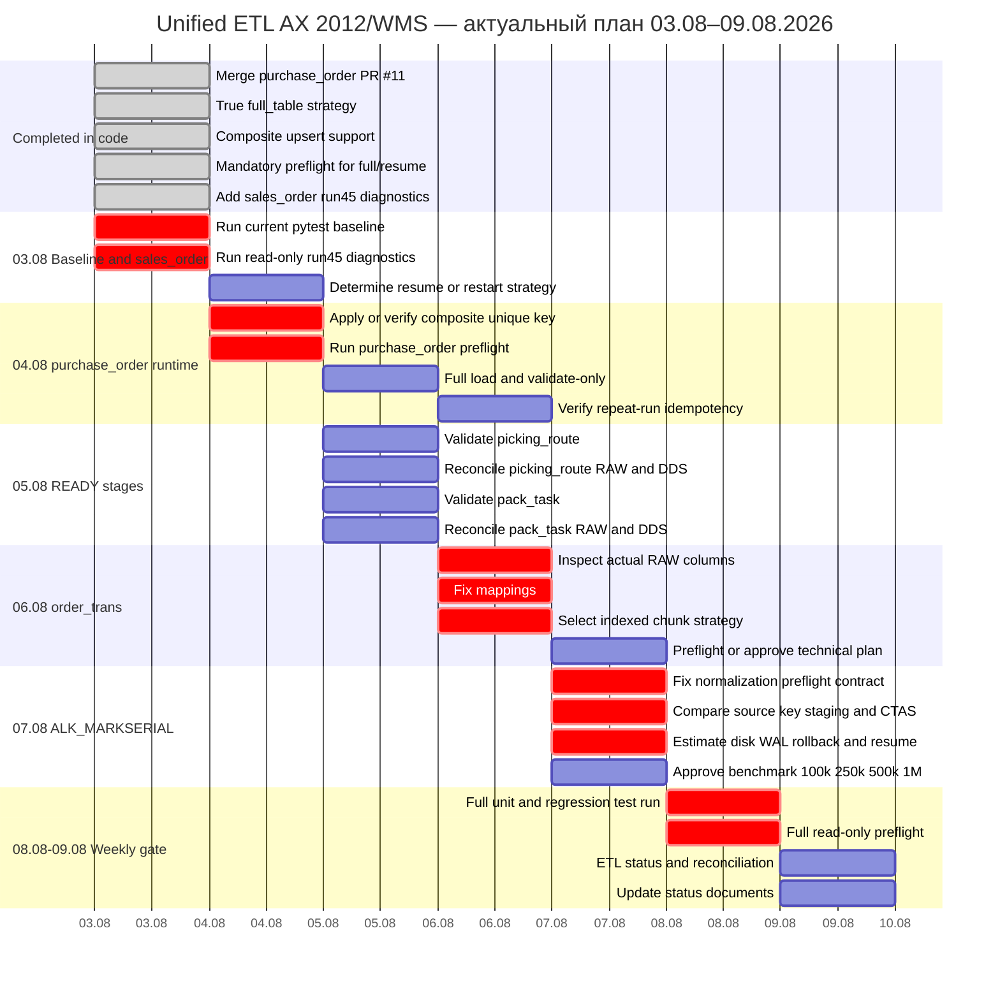

# ДИАГРАММА ГАНТА — UNIFIED ETL

**Обновлено:** 2026-08-03 14:15



## Текущий readiness

```text
READY FOR RUNTIME CHECK:
- purchase_order

READY / VALIDATION REQUIRED:
- picking_route
- pack_task

READY WITH INVESTIGATION REQUIRED:
- sales_order

BLOCKED:
- order_trans
- serial_mark_normalization
- serial_mark
```

## Фактически завершено

```text
purchase_order code fix merged
→ full_table corrected
→ composite conflict key supported
→ ON CONFLICT DO UPDATE supported
→ mandatory preflight added
→ regression tests added

sales_order run45 diagnostic toolkit added
```

Это завершение разработки, а не подтверждение production/runtime загрузки.

## Критический путь

```text
current pytest baseline
→ sales_order run45 diagnosis
→ purchase_order runtime validation
→ picking_route and pack_task validation
→ order_trans indexed design
→ serial_mark architecture decision
→ weekly gate
```

## Условия перехода

- `purchase_order` считается закрытым только после `preflight = READY`, нового `COMPLETED` run и repeat-run проверки;
- `sales_order` нельзя возобновлять до разбора run 45;
- `order_trans` не запускается при Seq Scan или неиндексируемом chunk key;
- `serial_mark` не изменяет RAW массовым UPDATE;
- blocked stage запрещено запускать в `full`;
- любой изменяющий запуск предваряется проверкой диска, WAL, activity, vacuum, index progress и locks.
